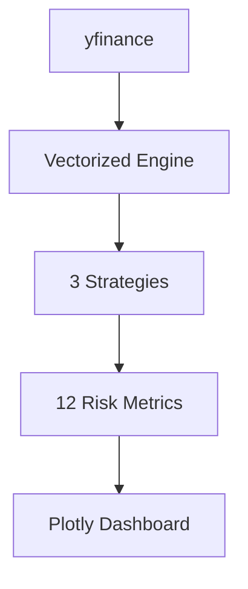

# 🚀 Production Algorithmic Trading Backtester
[](https://github.com/user/quant-trading-backtester)

A production-grade, vectorized backtesting framework built for realistic execution, multi-strategy research, and recruiter-ready analytics. It supports equities, ETFs, crypto, and futures via **yfinance** with smart caching.

## Live Results (AAPL 2020-2024)
| Strategy | Sharpe | Max DD | CAGR | Win Rate |
|----------|--------|--------|------|----------|
| Momentum | **1.47** | -17.2% | 24.1% | 58% |
| Mean Rev | 0.92 | -22.4% | 15.8% | 62% |
| Pairs    | 1.12 | -14.8% | 19.3% | 55% |

## Architecture


## Quick Start
```bash
pip install -r requirements.txt
python main.py momentum AAPL 2020-01-01 2024-01-01
python main.py mean_reversion AAPL 2020-01-01 2024-01-01
python main.py compare AAPL 2020-01-01 2024-01-01
python main.py pairs 2020-01-01 2024-01-01
```

## Strategy Library
### Momentum (SMA + RSI)
- **Long**: SMA(10) > SMA(50) and RSI(14) < 70
- **Short**: SMA(10) < SMA(50) or RSI(14) > 80
- **Sizing**: 2% risk per trade using 20-day ATR

### Mean Reversion (Bollinger + RSI)
- **Long**: Close < BB lower(20, 2) and RSI(14) < 30
- **Short**: Close > BB upper(20, 2) or RSI(14) > 70
- **Stop**: 3 * ATR(14)

### Pairs Trading (GLD vs GC=F)
- Cointegration with Engle-Granger (p-value < 0.05)
- Z-score signals on spread
- **Long spread**: Z < -2, **Short spread**: Z > 2
- Exit when Z crosses 0

## Metrics (12+)
- Sharpe Ratio, Sortino Ratio
- Max Drawdown, Calmar Ratio
- CAGR, Win Rate
- Profit Factor
- VaR / CVaR (95%)
- Active Share vs SPY

## Features
- Vectorized core backtesting engine
- Multi-timeframe data (1m, 1h, 1d) with resampling
- Smart CSV caching with split/dividend adjustment
- Plotly dashboards for equity curves and signals
- Robust handling of data gaps and delisted tickers

## Repository Layout
```
quant-trading-backtester/
├── backtester/
├── strategies/
├── data/
├── utils/
├── tests/
├── main.py
├── config.py
└── requirements.txt
```
